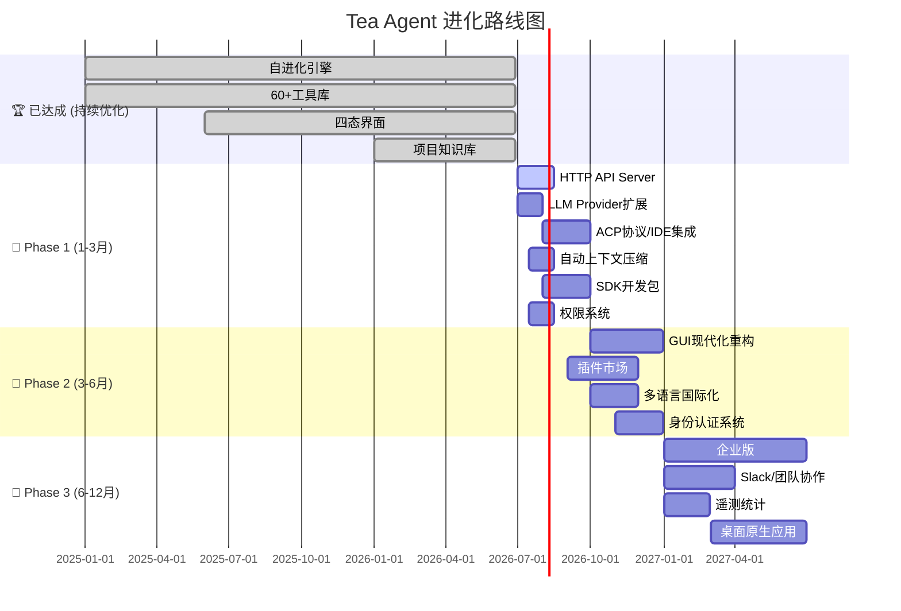

# Tea Agent 进化路线图

> 调研日期：2026-06-27
> 比对项目：**OpenCode** (anomalyco/opencode, 179k⭐) · **OpenCode Go** (opencode-ai/opencode, 13k⭐ → Crush) · **ZCode** (智谱 GLM-5.2 桌面端)
> 当前版本：**Tea Agent v0.9.36** (Python)

---

## 一、项目全景对比

| 维度 | Tea Agent (当前) | OpenCode (anomalyco) | OpenCode (Go→Crush) | ZCode (智谱) |
|------|:---:|:---:|:---:|:---:|
| **语言** | Python | TypeScript | Go | JS/Electron |
| **Stars** | ~? | **179,190** | 13,100 | 非开源 |
| **架构** | 单体+工具库 | **Monorepo (30+ packages)** | 单体 | 桌面应用 |
| **界面** | Web/GUI/TUI/CLI | Terminal/Desktop/Web | TUI | Desktop |
| **自进化** | ✅ **核心特性** | ❌ 无 | ❌ 无 | ❌ 无 |
| **工具数量** | **60+** | 有限内置 | 10+ | 有限 |
| **插件系统** | MCP协议 | ✅ Plugin + SDK | MCP | Natroc插件市场 |
| **多Agent** | ✅ 分治并发 | ✅ Sub-agent | ✅ Agent tool | ❌ |
| **企业版** | ❌ | ✅ Enterprise包 | ❌ | ❌ |

---

## 二、功能维度详细比对

### 1. 🧠 核心引擎

| 能力 | Tea Agent | OpenCode(TS) | OpenCode(Go) | ZCode | 优先级 |
|------|:---:|:---:|:---:|:---:|:---:|
| 自进化/自修改 | **✅** | ❌ | ❌ | ❌ | 🏆 **独特优势** |
| 动态工具注册 | **✅** | ❌ | ❌ | ❌ | 🏆 **独特优势** |
| 提示词进化 | **✅** | ❌ | ❌ | ❌ | 🏆 **独特优势** |
| 经验固化 | **✅** | ❌ | ❌ | ❌ | 🏆 **独特优势** |
| LLM Provider多样性 | 中等(~10) | 丰富(20+) | **丰富(75+)** | 仅GLM | 🔺 **需增强** |
| 流式推理 | ✅ | ✅ | ✅ | ✅ | 已有 |

### 2. 🛠 工具系统

| 能力 | Tea Agent | OpenCode(TS) | OpenCode(Go) | ZCode | 优先级 |
|------|:---:|:---:|:---:|:---:|:---:|
| 工具数量 | **60+** | ~15 | ~12 | ~10 | 🏆 **领先** |
| 文件编辑(diff) | ✅ diff/多种 | ✅ patch | ✅ edit/patch | ✅ | 已有 |
| 搜索(web/code) | ✅ | ✅ grep/glob | ✅ grep/glob | ✅ | 已有 |
| 终端执行 | ✅ | ✅ | ✅ bash | ✅ | 已有 |
| **截图/OCR** | ✅ **独有** | ❌ | ❌ | ❌ | 🏆 **独特优势** |
| **浏览器操控** | ✅ **独有** | ❌ | ❌ | ❌ | 🏆 **独特优势** |
| **GUI自动化** | ✅ **独有** | ❌ | ❌ | ❌ | 🏆 **独特优势** |
| **MCP协议** | ✅ | ✅ | ✅ | 插件市场 | 已有 |
| 定时任务/调度器 | ✅ **独有** | ❌ | ❌ | ❌ | 🏆 **独特优势** |
| **LSP集成** | ✅ (jedi+ruff) | ✅ (内部实现) | ✅ (gopls等) | ❌ | 🔺 **可优化** |

### 3. 🖥 用户界面

| 能力 | Tea Agent | OpenCode(TS) | OpenCode(Go) | ZCode | 优先级 |
|------|:---:|:---:|:---:|:---:|:---:|
| Web界面 | ✅ Starlette+SSE | ✅ Web包 | ❌ | ❌ | 已有 |
| GUI桌面 | ✅ Tkinter | ✅ Desktop(Electron) | ❌ | ✅ Electron | 🔺 **GUI质量待提升** |
| TUI终端 | ✅ Textual | ✅ Ink/React | ✅ Bubble Tea | ❌ | 已有 |
| CLI模式 | ✅ | ✅ CLI包 | ✅ | ❌ | 已有 |
| **移动端** | ❌ | ❌ | ❌ | ❌ | 🔮 远期 |
| **IDE集成** | ❌ | ✅ VS Code ext计划 | ✅ ACP/Bridge | ✅ ACP | 🔺 **急需** |
| **Slack/团队协作** | ❌ | ✅ Slack包 | ❌ | ❌ | 🔮 远期 |

### 4. 📦 工程化与生态

| 能力 | Tea Agent | OpenCode(TS) | OpenCode(Go) | ZCode | 优先级 |
|------|:---:|:---:|:---:|:---:|:---:|
| 包管理 | pip/PyPI | npm | go install/brew | 官网下载 | 已有 |
| **SDK/二次开发** | ❌ | ✅ **完善的SDK** | ❌ | ❌ | 🔺 **急需** |
| **插件市场** | MCP(通用) | ✅ Plugin系统 | MCP | ✅ Natroc | 🔺 **可增强** |
| 企业特性 | ❌ | ✅ Enterprise包 | ❌ | ❌ | 🔮 远期 |
| 身份认证 | ❌ | ✅ Identity包 | ❌ | ✅ 账户系统 | 🔺 **需要** |
| 会话管理 | ✅ SQLite | ✅ Drizzle+SQLite | ✅ SQLite | ✅ | 已有 |
| CI/CD | 基础 | ✅ 完善CI | ✅ | N/A | 🔺 **可增强** |
| 多语言支持 | 中/英 | **多语言(20+)** | 英 | 中/英 | 🔺 **需要** |
| 遥测/统计 | ❌ | ✅ Stats包 | ❌ | ✅ | 🔮 远期 |

### 5. ⚡ 高级特性

| 能力 | Tea Agent | OpenCode(TS) | OpenCode(Go) | ZCode | 优先级 |
|------|:---:|:---:|:---:|:---:|:---:|
| 项目知识库 | ✅ **独有** | ❌ | ❌ | ❌ | 🏆 **独特优势** |
| 记忆系统 | ✅ | ❌ | ❌ | ✅ | 已有 |
| 反思/元认知 | ✅ | ❌ | ❌ | ❌ | 🏆 **独特优势** |
| TODO/Plan | ✅ | ❌ | ❌ | ❌ | 🏆 **独特优势** |
| 工作模式(6阶段) | ✅ | agent切换(build/plan) | ❌ | ❌ | 已有 |
| 任务评估 | ✅ | ❌ | ❌ | ❌ | 🏆 **独特优势** |
| 自动上下文压缩 | ❌ | ❌ | ✅ auto-compact | ❌ | 🔺 **需要** |
| **HTTP API Server** | ❌ | ✅ Server包 | ❌ | ❌ | 🔺 **急需** |
| **ACP协议支持** | ❌ | ❌ | ❌ | ✅ ACP bridge | 🔺 **需要** |
| **函数调用录制** | ❌ | ✅ http-recorder | ❌ | ❌ | 🔮 远期 |
---

## 三、Tea Agent 进化进度表

### 已达成 🏆 (独特优势，保持并强化)

| # | 能力 | 状态 | 说明 |
|---|------|------|------|
| 1 | **自进化引擎** | ✅ 已实现 | 自我修改代码、创建工具、优化提示词 |
| 2 | **动态工具系统** | ✅ 60+工具 | 远超同类项目 |
| 3 | **项目知识库** | ✅ 2800+符号索引 | 含调用图、影响分析 |
| 4 | **截图/OCR/浏览器** | ✅ 独有 | 同类项目不具备 |
| 5 | **GUI自动化(鼠标键盘)** | ✅ 独有 | 同类项目不具备 |
| 6 | **定时任务调度** | ✅ 独有 | 同类项目不具备 |
| 7 | **反思/元认知** | ✅ 独有 | 自我分析改进 |
| 8 | **TODO/Plan系统** | ✅ 独有 | 任务追踪规划 |
| 9 | **任务评估/经验固化** | ✅ 独有 | 成功模式结晶 |
| 10 | **记忆/知识库** | ✅ 已有 | 长期记忆+项目知识 |

### Phase 1 🔺 (短期 1-3 个月，优先补齐)

| # | 能力 | 当前状态 | 目标 | 借鉴来源 | 难度 |
|---|------|---------|------|---------|:---:|
| 1 | **HTTP API Server** | ❌ 无 | 提供 REST API，支持外部调用和 CI/CD 集成 | OpenCode(TS) Server | ⭐⭐ |
| 2 | **LLM Provider 扩展** | ~10种 | 支持 50+ Provider (OpenRouter/Groq/Ollama/本地) | OpenCode(Go) 75+ | ⭐ |
| 3 | **IDE 集成 (ACP 协议)** | ❌ 无 | 实现 ACP 协议，嵌入 VS Code / Zed / JetBrains | ZCode ACP bridge | ⭐⭐⭐ |
| 4 | **自动上下文压缩** | ❌ 无 | 接近限制时自动摘要，防止 OOC 错误 | OpenCode(Go) auto-compact | ⭐⭐ |
| 5 | **SDK/二次开发包** | ❌ 无 | 提供 `tea-agent-sdk`，支持第三方扩展工具 | OpenCode(TS) SDK | ⭐⭐⭐ |
| 6 | **权限系统** | 基础 | 细粒度：文件读/写/执行/网络 分级控制 | OpenCode(Go) permission | ⭐⭐ |

### Phase 2 🔶 (中期 3-6 个月，体验提升)

| # | 能力 | 当前状态 | 目标 | 借鉴来源 | 难度 |
|---|------|---------|------|---------|:---:|
| 1 | **GUI 现代化重构** | Tkinter 基础 | Electron/Tauri 或 WebView2 现代化桌面 | OpenCode(TS) Desktop, ZCode | ⭐⭐⭐⭐ |
| 2 | **插件市场** | MCP(通用) | 专用插件注册/发现/一键安装 | OpenCode(TS) Plugin, Natroc | ⭐⭐⭐ |
| 3 | **多语言国际化** | 中/英 | i18n 框架，支持 20+ 语言 | OpenCode(TS) 多语言 | ⭐⭐ |
| 4 | **身份认证系统** | ❌ 无 | 用户登录/API Key 管理/多租户 | OpenCode(TS) Identity | ⭐⭐⭐ |
| 5 | **函数调用录制** | ❌ 无 | 录制回放工具调用，用于调试/测试 | OpenCode(TS) http-recorder | ⭐⭐ |
| 6 | **移动端 PWA** | ❌ 无 | 渐进式 Web 应用，手机浏览器可用 | - | ⭐⭐⭐ |

### Phase 3 🔷 (长期 6-12 个月，生态建设)

| # | 能力 | 当前状态 | 目标 | 借鉴来源 | 难度 |
|---|------|---------|------|---------|:---:|
| 1 | **企业版** | ❌ 无 | 团队协作、审计日志、RBAC 权限 | OpenCode(TS) Enterprise | ⭐⭐⭐⭐⭐ |
| 2 | **Slack/飞书集成** | ❌ 无 | 团队共享 Agent 会话和工具 | OpenCode(TS) Slack | ⭐⭐⭐ |
| 3 | **遥测与统计** | ❌ 无 | 工具使用率、性能监控、用量分析 | OpenCode(TS) Stats | ⭐⭐ |
| 4 | **CI/CD 自动流水线** | 基础 | 自动测试/构建/PyPI 发布/GitHub Actions | OpenCode(TS) CI | ⭐⭐ |
| 5 | **桌面原生应用** | Tkinter | Electron/Tauri 打包，自动更新 | OpenCode(TS) Desktop | ⭐⭐⭐⭐ |

---

## 四、架构演进建议

### 当前架构 (单体 + 工具库)
```
tea_agent/
├── agent.py          ← 主Agent引擎
├── toolkit/          ← 60+ 工具函数
├── session/          ← 会话管理
├── web/              ← Web界面
├── _gui/             ← GUI界面
├── multi_agent/      ← 多Agent
└── store/            ← 存储层
```

### 建议演进架构 (模块化 Monorepo)
借鉴 OpenCode(TS) 的 monorepo 结构，逐步拆分：

```
tea_agent/
├── packages/
│   ├── core/            ← 核心引擎(自进化/工具管理)
│   ├── cli/             ← CLI入口
│   ├── web/             ← Web界面 (已有)
│   ├── gui/             ← GUI界面 (重构)
│   ├── tui/             ← TUI界面 (已有)
│   ├── server/          ← ★ HTTP API Server (Phase 1)
│   ├── sdk/             ← ★ Python SDK (Phase 1)
│   ├── protocol/        ← ★ ACP/MCP协议层 (Phase 1)
│   ├── plugin/          ← ★ 插件系统 (Phase 2)
│   ├── identity/        ← ★ 身份认证 (Phase 2)
│   ├── desktop/         ← ★ 桌面应用 (Phase 3)
│   ├── docs/            ← 文档
│   └── stats/           ← 统计遥测 (Phase 3)
├── toolkit/             ← 工具库 (保持)
└── scripts/             ← 构建脚本
```

---

## 五、Top 5 关键差距分析

### 1️⃣ HTTP API Server ⭐⭐⭐⭐⭐
- **现状**: 只能通过 CLI/GUI/Web 本地使用
- **影响**: 无法被 CI/CD、外部工具、远程调用
- **方案**: 基于 Starlette 构建 REST API，复用现有 Agent 引擎
- **参考**: OpenCode(TS) 有完整 server/ 包，支持 HTTP + SSE

### 2️⃣ IDE 集成 (ACP 协议) ⭐⭐⭐⭐⭐
- **现状**: 无 IDE 集成能力
- **影响**: 用户需切换到终端使用，体验割裂
- **方案**: 实现 ACP (Agent Communication Protocol)，嵌入 VS Code / Zed
- **参考**: ZCode 社区已有 ACP bridge 实现

### 3️⃣ LLM Provider 扩展 ⭐⭐⭐⭐
- **现状**: 仅 ~10 种 Provider
- **影响**: 用户选择受限，无法使用本地模型
- **方案**: 集成 OpenRouter、Groq、Ollama、vLLM 等
- **参考**: OpenCode(Go) 支持 75+ Provider

### 4️⃣ SDK / 二次开发包 ⭐⭐⭐⭐
- **现状**: 无正式 SDK
- **影响**: 第三方无法扩展工具和能力
- **方案**: 提取核心 API，发布 `tea-agent-sdk` PyPI 包
- **参考**: OpenCode(TS) 完善的 @opencode-ai/sdk

### 5️⃣ 自动上下文压缩 ⭐⭐⭐
- **现状**: 无自动压缩
- **影响**: 长会话容易超出上下文窗口
- **方案**: 监控 token 用量，达 95% 自动触发摘要
- **参考**: OpenCode(Go) auto-compact 功能

---

## 六、进化路线总览图



---

*本路线图基于 2026-06-27 对 OpenCode (anomalyco/opencode 179k⭐)、OpenCode Go (opencode-ai/opencode 13k⭐) 和 ZCode (智谱 GLM-5.2) 的调研分析。*